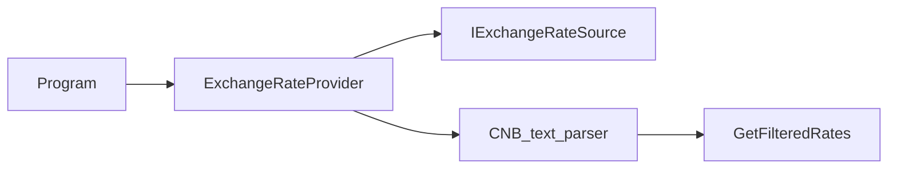

# ExchangeRateProvider implementation plan

Authoritative task plan for the `jobs/Backend` exercise. Update this file when the approach or scope changes.

## Agreed design (from discussion)

- **Fetch contract (Option A):** `IExchangeRateSource` exposes a method that returns the **raw daily rates document** (e.g. `string` or `Task<string>`), not pre-parsed models. Parsing stays separate (step 2), so swapping banks later means a new `(source + parser)` pair rather than overloading one parser.
- **Abstraction name:** `IExchangeRateSource` (concrete implementation provided separately).
- **Provider role:** [`Task/ExchangeRateProvider.cs`](Task/ExchangeRateProvider.cs) orchestrates: call source → parse → filter → return. A private helper such as `GetCnbRates` (or renamed once generic) stays **indirectly** testable via `GetExchangeRates` with a test double for `IExchangeRateSource`.
- **Testability:** Unit tests mock/fake `IExchangeRateSource` to return a fixed snippet; no real HTTP in provider tests. Any HTTP/`HttpClient` behaviour belongs in the **concrete source** implementation (optional dedicated tests there).

## Project layout (`IExchangeRateSource` placement)

For this task’s size, a **separate folder is not required**. Keeping `IExchangeRateSource` and its CNB implementation as **one or two `.cs` files next to** [`Task/ExchangeRateProvider.cs`](Task/ExchangeRateProvider.cs) under [`Task`](Task) is clear and easy to navigate.

Introduce a subfolder (e.g. `Sources/`, `Infrastructure/`, or `Cnb/`) only if you prefer that mental grouping or you expect several implementations and parsers to accumulate. It is a readability preference, not a technical requirement here.

## End-to-end flow

## Numbered work items (aligned with comments in [`Task/ExchangeRateProvider.cs`](Task/ExchangeRateProvider.cs))

1. **Fetch** — Implement `IExchangeRateSource` + concrete type (e.g. CNB URL, `HttpClient`). Inject `IExchangeRateSource` into `ExchangeRateProvider` via constructor. Replace the empty body of `GetCnbRates` (or equivalent) with: obtain raw text from the source, then hand off to parsing.
2. **Parse** — From the raw text: skip CNB header lines, split data lines by `|`, read country/code/amount/rate fields, **normalise** “rate per `Amount` units” into a single `decimal` suitable for `ExchangeRate.Value`, and build `ExchangeRate` instances with the **correct** `SourceCurrency` / `TargetCurrency` convention (CNB publishes foreign currency vs CZK — match what the task expects, typically one leg CZK).
3. **Filter** — Keep using `GetFilteredRates` logic for “only pairs involving requested currencies” and **do not** synthesise inverse pairs ([`Task.Tests/ExchangeRateProviderFilteringTests.cs`](Task.Tests/ExchangeRateProviderFilteringTests.cs) encodes that). **Watch-out:** [`Task/Currency.cs`](Task/Currency.cs) does not override `Equals`/`GetHashCode`, so `currencies.Contains(rate.SourceCurrency)` uses **reference** equality; either compare by `Code` (e.g. `Any(c => c.Code == rate.SourceCurrency.Code)`) or ensure the same `Currency` instances flow through — decide when implementing step 3.
4. **Return** — `GetExchangeRates` returns `IEnumerable<ExchangeRate>` as today; remove or relocate the scratch comments at the bottom of `ExchangeRateProvider.cs` once behaviour is implemented.

## Wiring and tests

- **Composition:** [`Task/Program.cs`](Task/Program.cs) currently does `new ExchangeRateProvider()`. After ctor injection, construct the real `IExchangeRateSource` implementation and pass it in (same place you’d register DI in a larger app).
- **Tests to update/add:**
  - [`Task.Tests/ExchangeRateProviderTests.cs`](Task.Tests/ExchangeRateProviderTests.cs): pass a fake `IExchangeRateSource`; assert empty vs non-empty using canned text.
  - [`Task.Tests/ExchangeRateProviderFilteringTests.cs`](Task.Tests/ExchangeRateProviderFilteringTests.cs): `InvokeGetFilteredRates` uses `new ExchangeRateProvider()` — update to a ctor that accepts a dummy source (or a test-specific helper) once the provider requires `IExchangeRateSource`.
  - Add parsing-focused tests (fixture: small multiline CNB-like string → expected `ExchangeRate` list) either on the provider with a fake source or on a dedicated parser type if you extract one.

## Checklist (high level)

- [ ] Add `IExchangeRateSource` + CNB HTTP implementation; inject into `ExchangeRateProvider` ctor
- [ ] Parse raw CNB text to `IEnumerable<ExchangeRate>` (headers, pipes, amount/rate normalisation, CZK leg)
- [ ] Fix filtering vs `Currency` equality if needed; wire `GetExchangeRates` end-to-end
- [ ] Update `Program` composition; adjust tests + add parse / fake-source tests

## Open choice (decide when coding)

- **Sync vs async:** `GetExchangeRates` and `Main` are synchronous today. If `IExchangeRateSource` is async (`Task<string>`), choose either an async public API (`GetExchangeRatesAsync` + `Main` using async entry) or a deliberate sync-over-async boundary — document the choice in [`DECISIONS.md`](DECISIONS.md).
