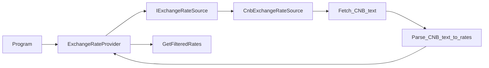

# ExchangeRateProvider implementation plan

Authoritative task plan for the `jobs/Backend` exercise. Update this file when the approach or scope changes.

## Agreed design (from discussion)

- **Source contract:** `IExchangeRateSource` exposes a parameterless method that returns parsed `ExchangeRate` objects. The concrete source owns any source-specific fetching and parsing needed to produce those objects; requested-currency filtering belongs in `ExchangeRateProvider`.
- **CNB parsing ownership:** CNB text parsing stays inside `CnbExchangeRateSource` for now, because the pipe-delimited CNB daily document format is specific to that source. Do **not** add a parser interface unless parsing grows enough to justify a separate type.
- **Abstraction name:** `IExchangeRateSource` (concrete implementation provided separately).
- **Provider role:** [`Task/ExchangeRateProvider.cs`](Task/ExchangeRateProvider.cs) orchestrates: call source → filter → return. It should not know CNB document shape, header lines, `|` columns, decimal separators, or amount/rate normalisation rules.
- **Testability:** Provider tests use a fake `IExchangeRateSource` returning fixed `ExchangeRate` instances. CNB HTTP and parsing behaviour belong in dedicated `CnbExchangeRateSource` tests with stubbed HTTP.

## Project layout (`IExchangeRateSource` placement)

For this task’s size, a **separate folder is not required**. Keeping `IExchangeRateSource` and its CNB implementation as **one or two `.cs` files next to** [`Task/ExchangeRateProvider.cs`](Task/ExchangeRateProvider.cs) under [`Task`](Task) is clear and easy to navigate.

Introduce a subfolder (e.g. `Sources/`, `Infrastructure/`, or `Cnb/`) only if you prefer that mental grouping or you expect several implementations and parsers to accumulate. It is a readability preference, not a technical requirement here.

## End-to-end flow

## Numbered work items (aligned with comments in [`Task/ExchangeRateProvider.cs`](Task/ExchangeRateProvider.cs))

1. **Fetch** — Implement `IExchangeRateSource` + concrete CNB type (CNB URL, `HttpClient`, options). Inject `IExchangeRateSource` into `ExchangeRateProvider` via constructor. The concrete source fetches the raw CNB daily text and returns parsed `ExchangeRate` objects without taking requested currencies.
2. **Parse** — Inside `CnbExchangeRateSource`, from the raw text: skip CNB header lines, split data lines by `|`, read country/code/amount/rate fields, **normalise** “rate per `Amount` units” into a single `decimal` suitable for `ExchangeRate.Value`, and build `ExchangeRate` instances with the **correct** `SourceCurrency` / `TargetCurrency` convention (CNB publishes foreign currency vs CZK — match what the task expects, typically one leg CZK).
3. **Filter** — Keep using `GetFilteredRates` logic for requested source currencies and **do not** synthesise inverse pairs ([`Task.Tests/ExchangeRateProviderFilteringTests.cs`](Task.Tests/ExchangeRateProviderFilteringTests.cs) encodes that). CNB publishes rates as foreign currency against CZK, so `CZK` is implicit and does not need to be requested. [`Task/Currency.cs`](Task/Currency.cs) now implements value equality by `Code`, so `currencies.Contains(rate.SourceCurrency)` works for separate `Currency` instances with the same ISO code.
4. **Return** — `GetExchangeRates` returns `IEnumerable<ExchangeRate>` as today; remove or relocate the scratch comments at the bottom of `ExchangeRateProvider.cs` once behaviour is implemented.

## Wiring and tests

- **Composition:** [`Task/Program.cs`](Task/Program.cs) is the composition root. It wires the real `IExchangeRateSource` implementation and passes it to `ExchangeRateProvider` via DI or explicit construction.
- **Tests:**
  - [`Task.Tests/ExchangeRateProviderTests.cs`](Task.Tests/ExchangeRateProviderTests.cs): pass a fake `IExchangeRateSource`; assert empty vs non-empty using canned `ExchangeRate` instances.
  - [`Task.Tests/ExchangeRateProviderFilteringTests.cs`](Task.Tests/ExchangeRateProviderFilteringTests.cs): invoke `GetFilteredRates` through reflection with an `ExchangeRateProvider` constructed from a dummy fake source.
  - [`Task.Tests/CnbExchangeRateSourceIntegrationTests.cs`](Task.Tests/CnbExchangeRateSourceIntegrationTests.cs): use stubbed HTTP responses to cover CNB document parsing and HTTP failures.

## Checklist (high level)

- [x] Add `IExchangeRateSource` + CNB HTTP implementation; inject into `ExchangeRateProvider` ctor
- [x] Parse raw CNB text to `IEnumerable<ExchangeRate>` inside `CnbExchangeRateSource` (headers, pipes, amount/rate normalisation, CZK leg)
- [x] Filter by requested source currencies using `Currency` equality; wire `GetExchangeRates` end-to-end
- [x] Update `Program` composition to wire source into provider
- [x] Adjust provider/filtering tests to use fake or dummy sources; keep source tests for HTTP parsing
- [x] Set a bounded timeout on the CNB `HttpClient` registration so the executable does not hang indefinitely on network stalls

## Resolved choice

- **Sync vs async:** Keep the public `GetExchangeRates` API synchronous for this assignment and use a deliberate sync-over-async boundary when calling the async `IExchangeRateSource`. This choice is documented in [`DECISIONS.md`](DECISIONS.md).

## Future production hardening

- **Retries:** Consider adding a conservative retry policy for transient CNB HTTP failures only (timeouts, `408`, `429`, and `5xx` responses). Avoid retrying permanent client/configuration failures such as `400`, `401`, `403`, or `404`. If implemented, prefer the .NET HTTP resilience extensions over a hand-rolled retry loop and document the package/policy choice in [`DECISIONS.md`](DECISIONS.md).
- **Freshness:** CNB daily-rate files include a publication date in the header. A future iteration could parse that date, log it with the parsed rates, expose it alongside the returned data if the public model evolves, and warn when the document appears unexpectedly stale. Any staleness threshold should account for weekends and bank holidays.
