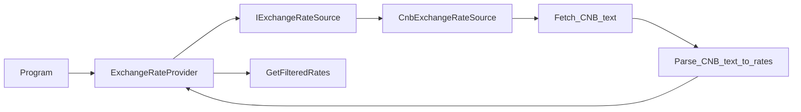

# ExchangeRateProvider implementation plan

Authoritative task plan for the `jobs/Backend` exercise. Update this file when the approach or scope changes.

## Architecture and principles

The solution keeps the exchange-rate workflow split into small responsibilities. `ExchangeRateProvider` orchestrates the use case: it asks a source for rates, filters them by requested source currency, and returns only source-provided rates. CNB-specific HTTP fetching and text parsing stay inside `CnbExchangeRateSource`.

The main architectural pattern is dependency injection. `ExchangeRateProvider` depends on the `IExchangeRateSource` abstraction instead of constructing `CnbExchangeRateSource` directly. `CnbExchangeRateSource` also works as an adapter around the external CNB daily-rate feed: it translates the external pipe-delimited text format into the internal `ExchangeRate` model, so the rest of the application does not need to know about CNB headers, columns, decimal separators, or amount normalization.

The design follows several SOLID principles:

- **Single Responsibility Principle:** `ExchangeRateProvider` handles orchestration and filtering, while `CnbExchangeRateSource` handles CNB fetching and parsing.
- **Dependency Inversion Principle:** `ExchangeRateProvider` depends on `IExchangeRateSource`, not on the concrete CNB implementation.
- **Open/Closed Principle:** another source could be added by implementing `IExchangeRateSource` without changing the provider’s filtering logic.
- **Interface Segregation Principle:** `IExchangeRateSource` exposes only the operation the provider needs: retrieving exchange rates.

The solution also uses standard .NET infrastructure patterns: the Options pattern for CNB configuration, `IHttpClientFactory` for HTTP client lifetime management, and a `Currency` value-object style equality implementation so separate `Currency` instances with the same ISO code compare correctly.

## Design

- **Source contract:** `IExchangeRateSource` exposes a parameterless method that returns parsed `ExchangeRate` objects. The concrete source owns any source-specific fetching and parsing needed to produce those objects; requested-currency filtering belongs in `ExchangeRateProvider`.
- **CNB parsing ownership:** CNB text parsing stays inside `CnbExchangeRateSource` for now, because the pipe-delimited CNB daily document format is specific to that source. A parser interface is unnecessary unless parsing grows enough to justify a separate type.
- **Abstraction name:** `IExchangeRateSource` (concrete implementation provided separately).
- **Provider role:** [`Task/ExchangeRateProvider.cs`](../Task/ExchangeRateProvider.cs) orchestrates: call source → filter → return. It should not know CNB document shape, header lines, `|` columns, decimal separators, or amount/rate normalisation rules.
- **Testability:** Provider tests use a fake `IExchangeRateSource` returning fixed `ExchangeRate` instances. CNB HTTP and parsing behaviour belong in dedicated `CnbExchangeRateSource` tests with stubbed HTTP.

## Project layout (`IExchangeRateSource` placement)

For this task’s size, a **separate folder is not required**. Keeping `IExchangeRateSource` and its CNB implementation as **one or two `.cs` files next to** [`Task/ExchangeRateProvider.cs`](../Task/ExchangeRateProvider.cs) under [`Task`](../Task) is clear and easy to navigate.

Introduce a subfolder (e.g. `Sources/`, `Infrastructure/`, or `Cnb/`) only if we prefer that mental grouping or expect several implementations and parsers to accumulate. It is a readability preference, not a technical requirement here.

## End-to-end flow

## Implementation Steps

1. **Fetch** — Implement `IExchangeRateSource` + concrete CNB type (CNB URL, `HttpClient`, options). Inject `IExchangeRateSource` into `ExchangeRateProvider` via constructor. The concrete source fetches the raw CNB daily text and returns parsed `ExchangeRate` objects without taking requested currencies.
2. **Parse** — Inside `CnbExchangeRateSource`, from the raw text: skip CNB header lines, split data lines by `|`, read country/code/amount/rate fields, **normalise** “rate per `Amount` units” into a single `decimal` suitable for `ExchangeRate.Value`, and build `ExchangeRate` instances with the **correct** `SourceCurrency` / `TargetCurrency` convention (CNB publishes foreign currency vs CZK — match what the task expects, typically one leg CZK).
3. **Filter** — Keep using `GetFilteredRates` logic for requested source currencies and **do not** synthesise inverse pairs ([`Task.Tests/ExchangeRateProviderFilteringTests.cs`](../Task.Tests/ExchangeRateProviderFilteringTests.cs) encodes that). CNB publishes rates as foreign currency against CZK, so `CZK` is implicit and does not need to be requested. [`Task/Currency.cs`](../Task/Currency.cs) now implements value equality by `Code`, so `currencies.Contains(rate.SourceCurrency)` works for separate `Currency` instances with the same ISO code.
4. **Return** — `GetExchangeRates` returns `IEnumerable<ExchangeRate>` as today

## Wiring and tests

- **Composition:** [`Task/Program.cs`](../Task/Program.cs) is the composition root. It wires the real `IExchangeRateSource` implementation, binds and validates CNB options from configuration, applies the typed `HttpClient` resilience policy, and passes the source to `ExchangeRateProvider` via DI.
- **Tests:**
  - [`Task.Tests/ExchangeRateProviderTests.cs`](../Task.Tests/ExchangeRateProviderTests.cs): pass a fake `IExchangeRateSource`; assert empty vs non-empty using canned `ExchangeRate` instances.
  - [`Task.Tests/ExchangeRateProviderFilteringTests.cs`](../Task.Tests/ExchangeRateProviderFilteringTests.cs): invoke `GetFilteredRates` through reflection with an `ExchangeRateProvider` constructed from a dummy fake source.
  - [`Task.Tests/CnbExchangeRateSourceIntegrationTests.cs`](../Task.Tests/CnbExchangeRateSourceIntegrationTests.cs): use stubbed HTTP responses to cover CNB document parsing and HTTP failures.

## Production hardening

- **Retries and timeouts:** CNB HTTP calls use the .NET HTTP resilience extensions with configurable total timeout, per-attempt timeout, retry count, retry delay, exponential backoff, and jitter. The source class stays focused on fetching and parsing; the HTTP policy lives in the composition root.
- **Freshness:** CNB daily-rate files include a publication date in the header. A future iteration could parse that date, log it with the parsed rates, expose it alongside the returned data if the public model evolves, and warn when the document appears unexpectedly stale. Any staleness threshold should account for weekends and bank holidays.

